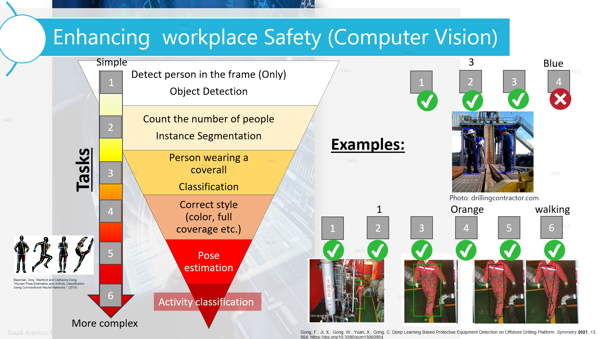

# SafeAI: Enhancing workplace Safety

The oil and gas industry is inherently hazardous, with workers facing a range of safety risks on a
daily basis. To mitigate these risks, companies implement safety protocols including the use of
personal protective equipment (PPE) such as hard hats, fire resistant clothing, specialized
coveralls, safety shoes, safety glasses, and gloves, as well as strict guidelines for behavior and
communication on the rig. Additionally, CCTV cameras operate twenty-four-seven to monitor
the safety of the employees, and ensure set protocols are met for safe operation. However,
manual identification of safety hazards and unsafe behavior can be time-consuming, prone to
errors, and subject to human biases.
By leveraging computer vision and machine learning algorithms, AI can automatically identify
and flag safety hazards such as workers not wearing the correct PPE or engaging in unsafe
behavior. This can help improve safety outcomes by allowing for faster identification and
correction of safety hazards, reducing the risk of accidents and injuries on the rig.



Goal: Development of a deep Learning model that can identify safe/unsafe behavior (coverall,
actions etc.) from CCTV images/videos in real time.
Working environment: Offshore platform (in the sea).
Working conditions: In offshore operations, workers are required to wear specialize coveralls
with a distinctive color to stand out with respect to the surrounding environment. The CCTV
cameras are mounted (fixed) at different locations around the platform.
Hint: The color of the coverall matters

## Challenges to consider:
- Low resolution of CCTV footage
- Low contrast (colors) with background environment
- Low visibility (night)
- Weather conditions (humidity, shadow, light etc.)
- Lack of labeled data from the field
- Odd camera angles (view point)
There are 6 computer vision tasks that increase in difficulty, the winning team will be able to
accomplish the largest number of tasks in a creative way (of course with good accuracy). The tasks also sorted by the importance. 

There is a limited number of labeled data from the field, therefore training will be done on open-
source images, while inference will be made on field videos. Labeled images will be shared with
each team upon completion of each task (checkpoints). While the videos will be shared closer to
the end of the challenge. There are no gridlines for the model, let your creativity shine.
Hint: think of how you can group some tasks.
Metric: You will be judged on the creativity of your solution, practicality, and overall results
(along with your presentation style). Let the best team win!
** The winning model will be taken for field trial, come and see your work translate to reality.

## Impact:
1. Significantly improve safety in the workplace by reducing the risk of head injuries to
workers. This can lead to a decrease in lost workdays due to injury, workers&#39;
compensation claims, and associated costs.
2. Enable the company to comply with regulations and standards, thereby avoiding
potential fines and legal issues. This is aligned with the company’s strong commitment
to prioritizing safety in decision-making.
3. Improve operational efficiency by reducing the time and effort required for manual
inspections. This can free up workers to focus on other tasks, leading to increased
productivity and cost savings.

# Getting started

## Requierements

### Hardware

The codes provided are optimized for running on a CUDA capable NVIDIA GPU.
While not strictly required, the user is advised that the neural network training
process can take several hours when running on the GPU and may become prohibitively
long if running on a single CPU. 

### Software

The use of a Linux based operating system is strongly recommended. 
All codes were tested on a Ubuntu 22.04 system.

A working distribution of python 3.8 or higher is required.
The use of the [anaconda python distribution](https://www.anaconda.com/) is recommended
to ease the installation of the required python packages. We suggest to use Pytorch version 2.1 with CUDA 12.1. 


## Initial set up

The usage of an Ubuntu 18.04 system or similar with a CUDA capable GPU and the anaconda python
distribution is assumed for the rest of this document. 

### Obtaining the code

Begin by cloning this project. In a terminal, type:

```sh
$ git clone git@github.com:makamoa/safeai.git
```
### System setup

The use of a separate python virtual environment is recommended for running the provided
programs. The file "deepnano.yml" is provided to quickly setup this environment in Linux
systems. To create an environment using the provided file and activate it do:

```bash
$ cd safeai
$ conda env create -f safeai.yml
$ conda activate safeai
```
Note 'safeai.yml' is intended to be used only with Linux systems.
Should the user experience problems with this file or be using another system 
a full list of requierements for running the code is available in the file
'requierements.txt' of the repository.

Note 'safeai.yml' is intended to be used only with Linux systems.
Should the user experience problems with this file or be using another system, 
a full list of requierements for running the code is available in the file
'requierements.txt' of the repository.


To use a Jupyter notebook inside the created virtual environment, type the following code:

```bash
pip install ipykernel ipython kernel install --user --name=safeai
```
# Resources:

Gong, F.; Ji, X.; Gong, W.; Yuan, X.; Gong, C. Deep Learning Based Protective Equipment
Detection on Offshore Drilling Platform. Symmetry 2021, 13, 954.
https://doi.org/10.3390/sym13060954

https://github.com/rroy1212/PPE_Detection_YOLOv3/blob/master/PPE_and_Fire_Detection.ipy
nb

https://www.kaggle.com/code/mustafatayyipbayram/ppe-detection-yolo

https://medium.com/deepquestai/object-detection-training-preparing-your-custom-dataset-
6248679f0d1d

https://towardsdatascience.com/using-yolov3-for-real-time-detection-of-ppe-and-fire-
1c671fcc0f0e

https://github.com/ZijianWang-ZW/PPE_detection

https://github.com/y3mr3/PPE-Detection-YOLO

https://github.com/AnshulSood11/PPE-Detection-YOLO-Deep_SORT
Bearman, Amy, Stanford and Catherine Dong. “Human Pose Estimation and Activity
Classification Using Convolutional Neural Networks.” (2015).
There are many datasets for human detection, PPE , pose and activity detection that are available
through roboflow, Kaggle, superbAI, etc.


